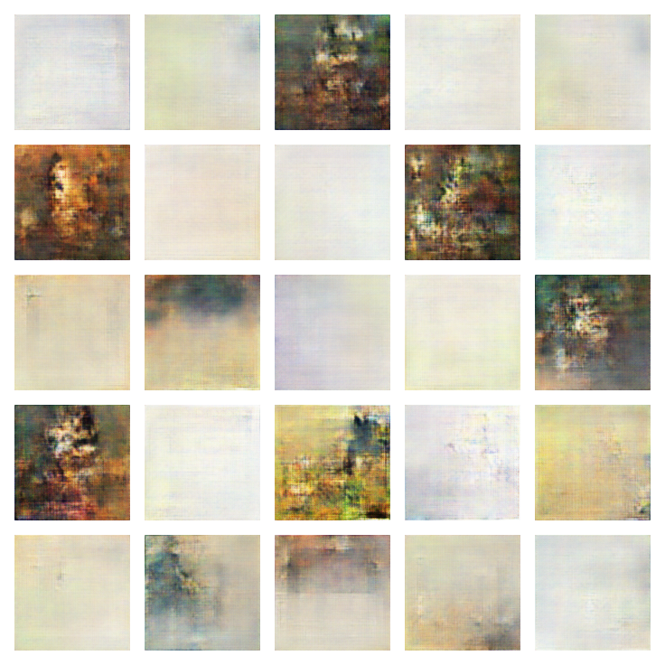

# aws-deep-learning

In the aws deep learning project we used Deep Learning to create poetry and paintings. Using the Habana drivers at DL1 instance. 

## Inspiration

The AI and Art worlds have great similarities. Being the most striking one, its ability to create value through creativity. However, both these worlds also face a similar challenge: the gap of recognition across women creators.

Our project aims to address the problem of lack of diversity in the arts world. Research shows that although women are about half of the art students, the majority of the art works promoted in exhibitions are still created by white male artists.

In this project we introduce the Deep Learning Art Assistant as a technology which aims to address the gender gap problem both in the art and tech world. 

This project is an extension of an already existing project by the AI Wonder Girls team, the ATHENA Art Assistant.  Our aim is to create an art assist that helps users getting inspired by art made by women, as well as empower more artists to use technology to build hybrid art with a combination of female and AI touches.

## What it does
Our Art assistant combines two advanced AI techniques to create art based on the work of women artists: Computer Vision and Natural Language Processing.

ATHENA also allows users to create its own art work based on the work of female artists. As its initial prototype, the assistant inspires users to create poems and original images based on open source art work from female and non-binary artists.

## How we built it
The ATHENA Art Assistant is built using TensorFlow and PyTorch libraries integrated to the AWS DL1 instance via a continuous integration deployment, where the two different AI applications are trained.

Details of implementation of each feature in the application are:
- **AI Paintings:** We use a generative adversarial network (GAN) to create images of female artists. Our is based on the wikiart data (https://www.wikiart.org/), which was searched for paintings by artists contained in the wikipedia list of female artists https://en.wikipedia.org/wiki/Lists_of_women_artists. Selecting only those yielded a dataset of 66 artists and 2632 images.
- **AI Poetry:** The implementation was done by training a Long Short Term Memory (LSTM) Recurrent Neural Network on the Poetry Foundation Kaggle Dataset. In order to consider only female, non-binary and transgender poets, the list poets from the dataset was tagged following the labels: Male (M), Female (F), Transgender (T), Non-Binary (NB).


## Challenges we ran into
- Finding Art data labelled in terms of gender/sex
- Identifying Open Source art works that represent minorities such as women, LGBTQ and people of color groups

## Accomplishments  

We are proud that we overcame our challenges with creativity and team work and built a data-centric pipeline that encompasses advanced AI techniques. We are also proud to contribute with a new feature to an existing open source initiative created by our team.

## What we learned
We were glad to keep learning about team spirit and taking the opportunity to learn more about advanced techniques and the problem of representativity in the arts world itself. We are also proud of exploring technical challenges such as implementing complex models (GANs LSTMs) and deploying them on AWS.

## The pillars of our project
**Scope:** AI is one of the game changers of this century, and in this project we investigate how advanced technologies such as GANs and NLP can be used for another real world application.

**Innovation:** The application combines state of the art AI technology to art following a data-centric approach, making it possible for single AI architectures to generate multiple different art works based on the data fed to the models. 

**Impact:** This initiative now only promotes the work of women artists as well as allows for a direct interaction between artists and technology, promoting the augmentation of ideas. 

## What's next for Deep Learning Art Assistant
This project is planned to be continued as an Open Source initiative in which both artists and programmers (in the AI/Data Science/Software Development fields) can collaborate.

- Artists can contribute by sharing data to be promoted or used as source of the AI models, while technical people can help with implementing new functionalities to the application.

- We plan to expand the datasets to artists from different culture in order to explore the different art expressions in the women's world

- We plan to deploy this project in a web application via Streamlit, in order to be integrated to the ATHENA Art Assistant.

## Generated Examples

### Generated images 



### Generated text

```text
	soul,
	i knew her,
	the long world
	at me,
	we your other.
	the body,
	the first- in me, and we want in the room,
	we have me.
	the room, and we is a first, i not —
	and we hip body,
	i am a long of the dream,
	we is not,
	in a body,
	and the first, and
	the body, and
	and my,
	i am her.
	we are the first, and we not like
	and the long of my body and the world
```
